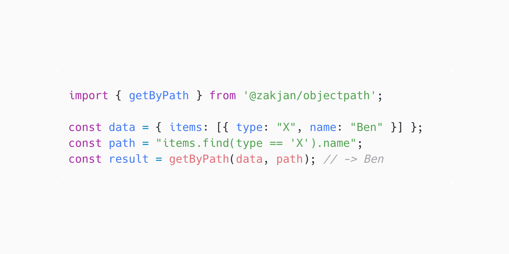

# ObjectPath

Expression language for querying JSON objects using ANTLR4. It can be easily ported into any target language supported as ANTLR4 runtime. Test usecases are shared to ensure consistent results. Currently implemented in TypeScript, Java.



## Usage

### JavaScript

#### Install

```
npm install @zakjan/objectpath
```

#### Use

```ts
import { getByPath } from '@zakjan/objectpath';

const data = { items: [{ type: "X", name: "Ben" }] };
const path = "items.find(type == 'X').name";
const result = getByPath(data, path); // -> Ben
```

### Java

#### Install

Add to `pom.xml`:

```xml
<dependency>
    <groupId>cz.zakjan</groupId>
    <artifactId>objectpath</artifactId>
    <version>x.y.z</version>
</dependency>
```

#### Use

```java
import static cz.zakjan.objectpath.GetByPath.getByPath;

Object data = new HashMap<String, Object>() {{
    put("items", new ArrayList<Object>() {{
        add(new HashMap<String, Object>() {{
            put("type", "X");
            put("type", "Ben");
        }});
    }});
}};
String path = "items.find(type == 'X').name";
Object result = getByPath(data, path); // -> Ben
```

## Syntax

The basic syntax is compatible with [lodash.get](https://lodash.com/docs#get). A simple syntax for simple cases, yet supporting more complex cases.

Supported features (by priority):

- access expressions
  - root object reference `$`
  - current object reference `@` - default, can be omitted
  - dot access<br>
    `object.field`
  - bracket access<br>
    `array[0]`<br>
    `array[-1]`<br>
    `object['a field']`
  - array find<br>
    `array.find(field == 'X')`<br>
    `array.find($.rootField == 'X')`
  - array filter<br>
    `array.filter(field == 'X')`<br>
    `array.filter($.rootField == 'X')`<br>
    `array.filter(field == 'X' && array.filter(field == 'Y'))`
  - array map<br>
    `array.map(field)`<br>
    `array.map(@ * 2)`
- functions
  - `toString`
  - `toNumber`
  - `join`
  - `split`
  - `sum`
  - `dateTimestampToIsoString` - returns date ISO string `YYYY-MM-DD'T'HH:mm:ss.SSSX`
  - `dateIsoStringToTimestamp` - accepts any valid date ISO string
- operators
  - unary `+` `-`
  - unary logical NOT `!`
  - multiplicative `*` `/`
  - additive `+` `-`
  - equality `==` `!=`
  - relational `<` `>` `<=` `>=`
  - logical AND `&&`
  - logical OR `||`
  - conditional `?:`
- primitives - string, number, boolean, `null`

See detailed examples in [test](test) directory.

**Strict equality**

Equality operator `==` uses strict equality, `===` in JS, `Object.equals` in Java.

**Strict boolean truth table**

`false`, `null` evaluates to `false`, everything else evaluates to `true`. This differs from JS, which evaluates `0`, `''` also to `false`.

**Logical operators on non-boolean operands**

In case of logical operator applied to non-boolean operands, left operand is coerced to boolean for condition check, and the original value of left or right operand is returned. For example `falseField || field` returns `field`.

Note that nullish coalescing operator `??` is different from logical OR `||`, it applies only if left side evaluates to `null`.

**Optional chaining**

Some programming languages have optional chaining operator `?.`. This is the default and only mode of operation of this library by design.

**Null vs. undefined**

In case of non-existing property, `null` is returned. This is because `undefined` is a JS-only construct, it even can't be stored in JSON.

**Parsing errors**

In case of parsing errors, function `getByPath` silently catches the error and returns `null`. If you wish to handle the error on your own, call `parsePath` and `getByParsedPath` separately.

## Why yet another library?

Other libraries are either missing more advanced extracting features or don't have consistent implementation across multiple languages.

**JSONPath**

- *(blocker)* doesn't use array filter result as context for further traversing, see https://github.com/json-path/JsonPath/issues/272
- *(blocker)* language-specific implementations are completely separate, they differ slightly in edge cases and path preprocessing is needed to make it behave consistently
- requires root object reference `$` in begining

**XPath**

- language-specific implementations are completely separate
- too different from JS syntax

**SpEL**

- language-specific implementations are completely separate

**jq**

- only C implementation

**lodash.get, JSONata, JSPath, dot-prop, ...**

- missing more advanced features

## TODO

- float/double primitives and operations
- long operations
- array slicing `array[start:end:step]`
- computed member access `object[path]`
- short circuiting - don't evaluate right side of operators if left side is enough
- complete operator precedence table - [JavaScript](https://developer.mozilla.org/en-US/docs/Web/JavaScript/Reference/Operators/Operator_Precedence), [Java](https://introcs.cs.princeton.edu/java/11precedence/)
- enable adding custom functions
- explore if also AST visitor can be generated from an universal language
