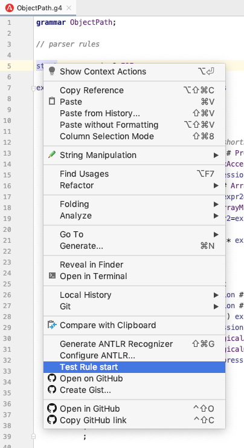
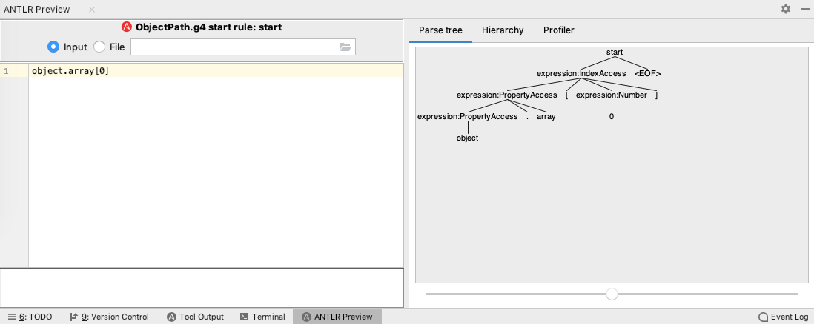

# ObjectPath

Expression language for querying JSON objects, based on formal ANTLR4 grammar. It can be easily ported into any target language. Test usecases are shared to ensure consistent results. Currently implemented in TypeScript, Java.

## Usage

### JavaScript

```
npm install @zakjan/objectpath
```

```
import { getByPath } from '@zakjan/objectpath';

const result = getByPath(object, path);
```

### Java

TODO

## Syntax

The basic syntax is compatible with [lodash.get](https://lodash.com/docs#get). A simple syntax for simple cases, yet supporting more complex cases.

Supported features (by priority):

- access expressions
  - root object reference `$`
  - current object reference `@` - default, can be omitted
  - dot access<br>
    `object.field`
  - bracket access<br>
    `array[0]`<br>
    `array[-1]`<br>
    `object['a field']`
  - array filter<br>
    `array.filter(field == 'X')`<br>
    `array.filter($.rootField == 'X')`<br>
    `array.filter(field == 'X' && array.filter(field == 'Y'))`
  - array map<br>
    `array.map(field)`<br>
    `array.map(@ * 2)`
- functions
  - `join`
  - `split`
  - `sum`
  - `dateTimestampToIsoString` - returns date ISO string `YYYY-MM-DD'T'HH:mm:ss.SSSX`
  - `dateIsoStringToTimestamp` - accepts any valid date ISO string
- operators
  - unary `+` `-`
  - unary logical NOT `!`
  - multiplicative `*` `/`
  - additive `+` `-`
  - equality `==` `!=`
  - relational `<` `>` `<=` `>=`
  - logical AND `&&`
  - logical OR `||`
  - conditional `?:`
- primitives - string, number, boolean, `null`

See detailed examples in [test](test) directory.

**Parsing errors**

In case of parsing errors, function `getByPath` silently catches the error and returns `null`. If you wish to handle the error on your own, call `parsePath` and `getByParsedPath` separately.

**Strict equality**

Equality operator `==` uses strict equality, `===` in JS, `Object.equals` in Java.

**Strict boolean truth table**

`false`, `null` evaluates to `false`, everything else evaluates to `true`. This differs from JS, which evaluates `0`, `''` also to `false`.

**Logical operators on non-boolean operands**

In case of logical operator applied to non-boolean operands, left operand is coerced to boolean for condition check, and the original value of left or right operand is returned. For example `falseField || field` returns `field`.

Note that nullish coalescing operator `??` is different from logical OR `||`, it applies only if left side evaluates to `null`.

**Optional chaining**

Some programming languages have optional chaining operator `?.`. This is the default and only mode of operation of this library by design.

**Null vs. undefined**

In case of non-existing property, `null` is returned. This is because `undefined` is a JS-only construct, it even can't be stored in JSON.

## Why yet another library?

Other libraries are either missing more advanced extracting features or don't have consistent implementation across multiple languages.

**JSONPath**

- *(blocker)* doesn't use array filter result as context for further traversing, see https://github.com/json-path/JsonPath/issues/272
- *(blocker)* language-specific implementations are completely separate, they differ slightly in edge cases and path preprocessing is needed to make it behave consistently
- requires root object reference `$` in begining

**XPath**

- language-specific implementations are completely separate
- too different from JS syntax

**SpEL**

- language-specific implementations are completely separate

**lodash.get, JSONata, JSPath, dot-prop**

- missing more advanced features

**jq**

- only C implementation

## Development

ANTLR4 grammar is used to formally describe the syntax and to generate string-to-AST parser. AST visitor is written manually, but in a consistent code style across languages. This is to enable easy porting into new target language.

**Directories**

- `grammar` - ANTLR4 grammar
- `objectpath-*` - language-specific implementation, with directory structure and package definition following langauage standards
  - `parser` - generated ANTLR4 string-to-AST parser
  - `visitor` - AST visitor and custom visitor functions
  - `GetByPath.*` - entry point to the library, contains main function `getByPath`
- `test` - test usecases

**Dependencies**

Dependencies for each language-specific implementation are managed by their respective package manager tools.

- `objectpath-ts` - npm
- `objectpath-java` - Maven

*(optional)* For direct CLI access to ANTLR4 compiler, download [Complete ANTLR Java binaries jar (antlr-4.7.2-complete.jar)](http://www.antlr.org/download.html). Useful aliases:

```
alias antlr4='java -cp ".:/usr/local/lib/antlr-4.7.2-complete.jar:$CLASSPATH" org.antlr.v4.Tool'
alias grun='java -cp ".:/usr/local/lib/antlr-4.7.2-complete.jar:$CLASSPATH" org.antlr.v4.gui.TestRig'
```

**Updating ANTLR4 grammar, parser**

When updating ANTLR4 grammar, run `./generate-parser.sh` to generate parsers in all target languages. **Don't edit parsers manually!** Then update AST visitors in each language respectively.

For visualizing AST, ANTLR IntelliJ plugin is recommended. Open `grammar/ObjectPath.g4`, right-click `start` rule, select "Test ANTLR rule", enter the input string into the left window, observe parse tree in the right window.




*The other option is `grun` tool. But it doesn't support grammar file and compiled Java files in separate directories, you'd need to disable `-package` option and output the parser to the same directory with grammar in `objectpath-java/generate-parser.sh`.*

**Updating AST visitor**

When updating AST visitor (`GetByPath.*`, `GetByPathVisitor.*`, `GetByPathVisitorFunctions.*`), keep them as close as possible in all languages. Although this might lead to code that is not idiomatic to the given language, it allows straightforward porting of new features.

## TODO

- array slicing `array[start:end:step]`
- computed member access `object[path]`
- short circuiting - don't evaluate right side of operators if left side is enough
- complete operator precedence table - [JavaScript](https://developer.mozilla.org/en-US/docs/Web/JavaScript/Reference/Operators/Operator_Precedence), [Java](https://introcs.cs.princeton.edu/java/11precedence/)
- enable adding custom functions
- explore if also AST visitor can be generated from an universal language
